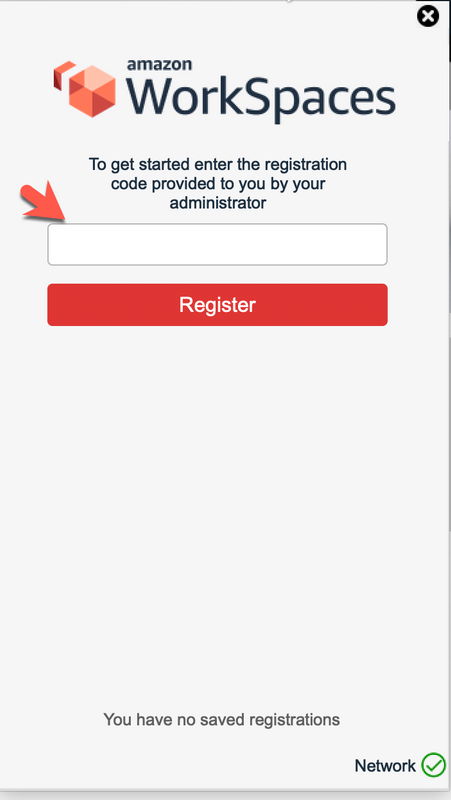
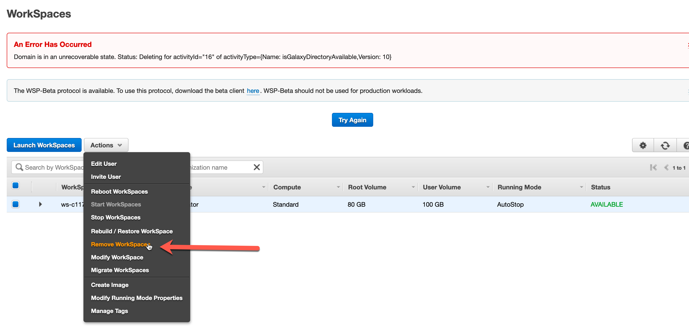
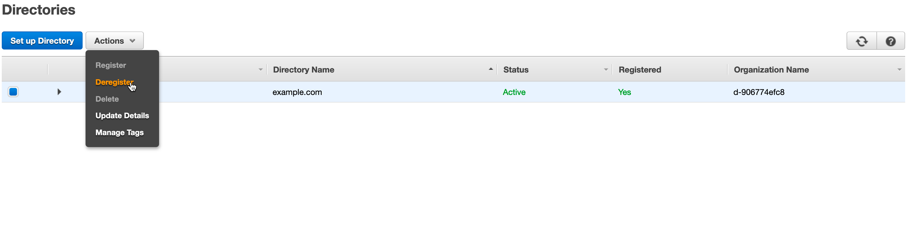
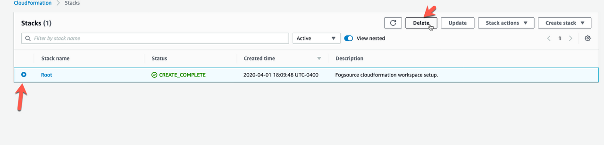

### Cloudformation Deployment

This guide will assist in the deployment of an AWS workspace environment by using a cloudformation template. The template will launch a *VPC*, *1 public subnet* and *2 private subnets*, a *NAT Gateway*, *Internet Gateway* along with a *elastic IP* and *routing tables* with proper networking routes. For the workspace it will create a *Simple Active Directory*, *AWS Workspace* environment according to specifications and lauch a *Lambda* (along with IAM policy and role observing least privilege) to configure it all together. 

##### Amazon WorkSpaces Pricing
With Amazon WorkSpaces, you pay only for what you use. You are charged based on the bundle type and the number of Amazon WorkSpaces you launch. There is no up-front commitment, and you can remove WorkSpaces at any time.

##### Monthly and Hourly Billing Options

Amazon WorkSpaces provides the flexibility to pay monthly or hourly. The charges for the Service apply on a monthly basis. With monthly billing, you pay a fixed monthly fee for unlimited usage during the month, which is best for workers who use their Amazon WorkSpace full-time or as their primary desktop. If a WorkSpace is launched after the first calendar day of a month, then the monthly price for that WorkSpace will be adjusted on a pro rated basis from the first day it was active to the end of that month. If a WorkSpace is terminated before the end of a month, then the monthly charge will still apply.

With hourly billing you pay a small fixed monthly fee per WorkSpace to cover infrastructure costs and storage, and a low hourly rate for each hour the WorkSpace is used during the month. Hourly billing works best when Amazon WorkSpaces are used, on average, for less than a full working day or for just a few days a month, making it ideal for part-time workers, job sharing, road warriors, short-term projects, corporate training, and education.

You can mix monthly and hourly billing within your AWS account, and you can also switch between billing options at any time during a billing period to optimize your AWS bill.

To get started log into your AWS account and navigate to cloudformation.

##### Download this template to your hard drive, then select create stack with new resources (standard). Hit upload template file, next *Choose file* and select the template from the location where it was downloaded.

##### For each parameter select the desired option or leave defaults. For WorkstationType the options are explained below:	

Workstation Type | info
-----------------| -----
Standard-Amazon-Linux2-Desktop | Amazon Linux 2 with PCoIP 2 vCPU 4GiB Memory 50GB Storage                                                                                            Standard with Amazon Linux 2 
Power-Amazon-Linux2-Desktop | Windows 7 Experience provided by Windows Server 2008 with PCoIP 8 vCPU 32GiB Memory 100GB Storage                                                        
Power-Win7-Desktop | Amazon Linux 2 with PCoIP 4 vCPU 16GiB Memory 100GB Storage                                                                                                      
Power-Win10-Desktop | Windows 10 Experience provided by Windows Server 2016 with Office 2016 and PCoIP 2 vCPU 7.5GiB Memory 100GB Storage Performance with Windows 10 and Office 2016 | Amazon

  
    
            
	

##### For the network section you can enter the CIDR you desire or leave defaults and then select 2 seperate availability zones for the private subnets to belong.

##### The parameters below specify the details for the active directory used by aws workspace. Enter the desired *username* and *password* and remember it because it will be used as credentials to authenticate into the workspace.

##### *Hit next, no need to enter any details here.

##### On the last page, hit the radio button to acknowledge that IAM resource will be created, then press create stack. 

##### After the cloudformation completed successfully, click on output to see some details needed to login. Before visiting the URL specified, note the username along with the password you entered before launching the stack to authenticate.

##### Search for workspaces in AWS, select the created workspace or the ID that matches the output in cloudformation above image, then hit the drop down arrow to see details and record the registration code.

##### Visit the URL, select the client to download for your operating system or you can use a web-based version and follow along on the next slide [https://clients.amazonworkspaces.com/webclient#/registration](https://clients.amazonworkspaces.com/webclient#/registration)

##### Enter the registration code, then enter the username and password.

### Success!!

### Cloudformation Tear-Down

To delete all the resources that were created by cloudformation, a manual step must be done first. Normally we could just delete the stack and all the resources would be removed, but as you will see, we are forced to enter a confirmation before deleting AWS directories, so first navigate to directory services.

After selecting the directory , delete all marked names with status Enabled. Click on the URL to the right then select the object to remove and delete

 

When back on the directories tab, when you try to deregister you will get the error below. It is because you need to remove the workspaces. Go to workspaces console then remove as depicted below

##### Go back to the cloudformation console, select the stack and hit delete stack and all other resources will be clean up.

##### It will take around 10 to 15 minutes for everything to be cleaned up and all resources deleted in AWS.